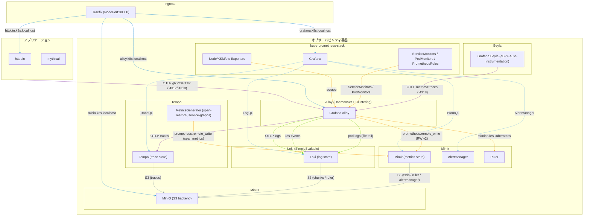

# alloy + kube-prom-stack

https://grafana.com/docs/alloy/latest/

以下をやってみる
- [x] alloy
  - [x] self monitoring
  - [x] prometheus.operator.podmonitors
  - [x] prometheus.operator.servicemonitors
  - [x] mimir.rules.kubernetes
  - [x] cluster label
  - [x] k8s events
  - [x] pod logs
  - [x] otel traces, metrics, logs
- kube-prom-stack
  - [x] without prometheus or alertmanager
  - [x] crds
  - [x] exporters & service monitors
  - [x] rules
  - [x] grafana
  - [x] dashboards
- [x] mimir
  - [x] ruler
  - [x] alertmanager
- [x] loki
- [x] tempo
- [x] beyla

## 構成図

## TODO
- readme
  - 構成図的なやつを claude に書かせる
以下は issue にして、いったんこれは終わりにする
- otel
  - beyla の metric は scrape と otel のどっちがよい？
  - k8s 系の属性が metric についてこない
    - scrape するなら `k8s_*` が付いてくるけど
      - `k8s_` prefix を外したやつがあった方が他と統一できてよいかも
    - otel metric の場合はどう扱う？
  - metric と trace を紐付けたい
    - 何かあったはず
- ingress
  - traefik.enabled を追加したい
  - host 名を変えられるようにしたい
    - helmfile の env にして、helmfile で set すればよさそうに思う
- mimir.rules.kubernetes
  - external label: cluster
